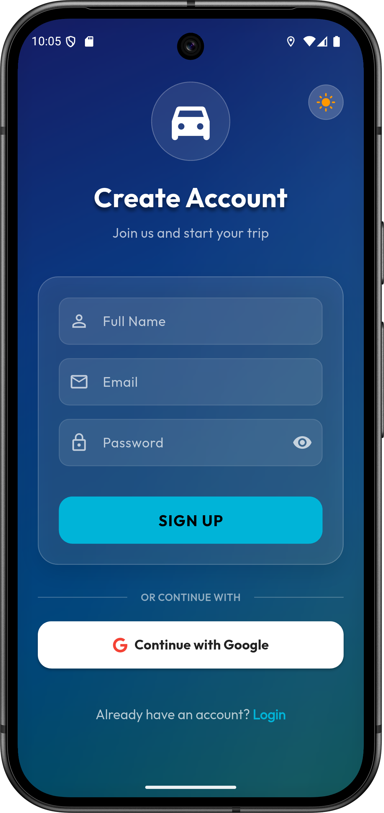
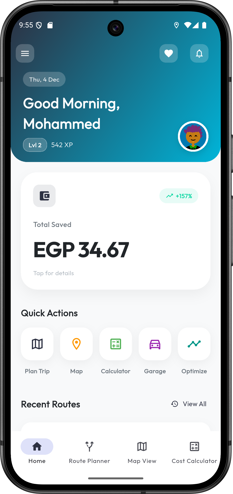
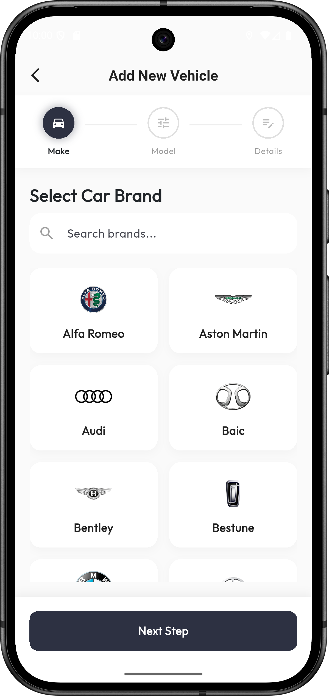

# 🚗 El-Meshwar (المشوار)


**El-Meshwar** is a comprehensive Egyptian Cost & Route Assistant application designed to help users plan their trips, calculate costs efficiently across various transportation modes (Car, Metro, Microbus, etc.), and manage their vehicle expenses.

---

## ✨ Key Features

### 🗺️ Smart Route Planning
- **Multi-Modal Routing**: Calculate routes for Driving, Walking, and Cycling.
- **Cost Estimation**: Get accurate cost estimates based on fuel prices, vehicle consumption, and public transport fares.
- **Interactive Maps**: Powered by `flutter_map` and OpenStreetMap.
- **Location Search**: Easy-to-use location picker with search functionality.

### 💰 Cost Calculator
- **Fuel Cost**: Calculates trip cost based on your specific vehicle's fuel type (Gasoline 80/92/95, Diesel, Natural Gas) and consumption.
- **Public Transport**: Built-in fare calculators for the Cairo Metro (tier-based) and Microbuses.
- **Savings Tracker**: Compare your trip cost against other modes to see how much you save.

### 🚘 Garage Management
- **My Vehicles**: Add and manage multiple vehicles.
- **Detailed Specs**: Store vehicle details like brand, model, year, fuel type, and consumption rates.
- **Maintenance**: (Planned) Track maintenance schedules.

### 🏆 Gamification & Rewards
- **XP System**: Earn XP for every trip you save and every EGP you save.
- **Badges**: Unlock badges for milestones (e.g., "Fuel Saver", "Road Warrior").
- **Leaderboard**: Compete with other users to be the top saver.

### 📊 Analytics & Insights
- **Trip History**: View detailed logs of your past trips.
- **Spending Analysis**: Visual charts showing your spending habits over time.
- **Savings Reports**: Track your total savings and environmental impact.

### 🔐 Secure Authentication
- **Supabase Auth**: Secure sign-up and login via Email/Password.
- **Social Login**: Support for Google and Facebook Sign-In.
- **Profile Management**: Manage your user profile and preferences.

---

## 🛠️ Tech Stack

- **Framework**: [Flutter](https://flutter.dev/)
- **Language**: [Dart](https://dart.dev/)
- **State Management**: [GetX](https://pub.dev/packages/get)
- **Backend**: [Supabase](https://supabase.com/) (PostgreSQL, Auth, Realtime)
- **Local Storage**: [Hive](https://docs.hivedb.dev/)
- **Maps**: [flutter_map](https://pub.dev/packages/flutter_map), [latlong2](https://pub.dev/packages/latlong2)
- **Routing API**: OpenRouteService
- **UI Components**: `flutter_animate`, `lottie`, `google_fonts`, `fl_chart`

---

## 🚀 Getting Started

### Prerequisites
- Flutter SDK (>=3.2.0)
- Dart SDK
- Android Studio / VS Code
- Git

### Installation

1.  **Clone the repository**
    ```bash
    git clone https://github.com/DEPI-Flutter-Projects/Final_Graduation_Project.git
    cd Final_Graduation_Project
    ```

2.  **Install dependencies**
    ```bash
    flutter pub get
    ```

3.  **Environment Setup**
    Create a `.env` file in the root directory and add your API keys:
    ```env
    SUPABASE_URL=your_supabase_url
    SUPABASE_ANON_KEY=your_supabase_anon_key
    ```
    > **Note**: You need to set up your own Supabase project or ask the project maintainer for access keys.

4.  **Run the App**
    ```bash
    flutter run
    ```

---

## 📱 App Gallery

<div align="center">

### 🔐 Authentication & Onboarding
| Sign Up | Forgot Password |
|:---:|:---:|
|  |  |

### 🏠 Home & Profile
| Home Screen | Profile Overview | Profile Details |
|:---:|:---:|:---:|
|  |  |  |

### 🚘 Garage Management
| Garage List | Add Vehicle |
|:---:|:---:|
|  |  |

### 💰 Cost & Analytics
| Cost Analysis | Cost Breakdown | Analytics Overview | Detailed Analytics |
|:---:|:---:|:---:|:---:|
|  |  |  |  |

### 🗺️ Route Planning
| Route Analysis |
|:---:|
|  |

</div>

---

## 🤝 Contributing

Contributions are welcome! Please feel free to submit a Pull Request.

1.  Fork the project
2.  Create your Feature Branch (`git checkout -b feature/AmazingFeature`)
3.  Commit your changes (`git commit -m 'Add some AmazingFeature'`)
4.  Push to the Branch (`git push origin feature/AmazingFeature`)
5.  Open a Pull Request

---

## 📄 License

This project is licensed under the MIT License - see the [LICENSE](LICENSE) file for details.

---
