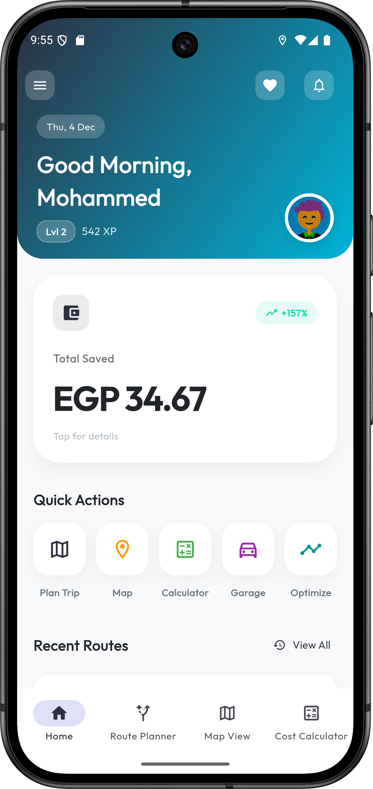
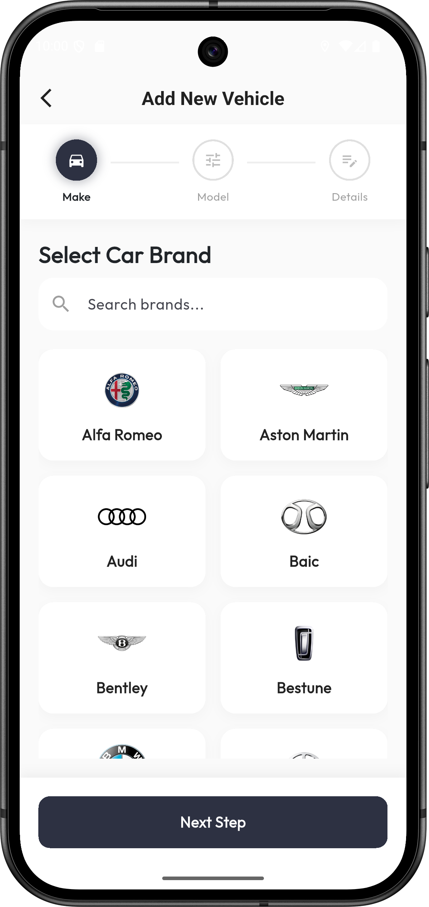

# 🚗 El-Meshwar (المشوار)

<div align="center">


### 🇪🇬 Smart Egyptian Transportation & Cost Assistant

Plan smarter trips, calculate transportation costs, manage vehicles, and track savings — all in one Flutter application.

</div>

---

# ✨ Overview

**El-Meshwar** is an intelligent transportation companion designed specifically for Egyptian users.  
The application helps users:

- Plan optimized routes
- Compare transportation methods
- Calculate trip costs
- Manage personal vehicles
- Track savings and analytics
- Enjoy gamified rewards

Built with scalability, clean architecture, and modern Flutter practices.

---

# 👨‍💻 Meet The Developers

<div align="center">

<table>
<tr>

<td align="center" width="50%">

<a href="https://github.com/mohany203">


### Mohammed Hany Gabr

Flutter Developer  
UI/UX & Application Architecture

</a>

</td>

<td align="center" width="50%">

<a href="https://github.com/Ahmed1Atef1">


### Ahmed Atef

Flutter Developer  
Backend Integration & Features

</a>

</td>

</tr>
</table>

</div>

---

# 🛠️ Tech Stack

| Category | Technologies |
|---|---|
| Framework | Flutter |
| Language | Dart |
| State Management | GetX |
| Backend | Supabase |
| Local Storage | Hive |
| Maps | flutter_map + OpenStreetMap |
| Routing API | OpenRouteService |
| UI Libraries | lottie, fl_chart, flutter_animate |

---

# 🚀 Core Features

## 🗺️ Smart Route Planning
- Multi-modal transportation support
- Route optimization
- Interactive maps
- Smart location search

## 💰 Transportation Cost Calculator
- Fuel consumption calculations
- Metro fare estimation
- Microbus cost estimation
- Savings comparison system

## 🚘 Garage Management
- Add multiple vehicles
- Store vehicle specifications
- Fuel tracking
- Planned maintenance system

## 📊 Analytics & Insights
- Trip history tracking
- Spending analytics
- Savings reports
- Environmental impact analysis

## 🏆 Gamification
- XP rewards system
- Achievement badges
- Leaderboard competition

## 🔐 Authentication
- Secure Supabase Authentication
- Email/Password login
- Google Sign-In
- Facebook Sign-In

---

# 📱 Application Preview

<div align="center">

## 🔐 Authentication

| Sign Up | Forgot Password |
|:--:|:--:|
|  |  |

---

## 🏠 Home & Profile

| Home | Profile | Details |
|:--:|:--:|:--:|
|  |  |  |

---

## 🚘 Garage

| Garage | Add Vehicle |
|:--:|:--:|
|  |  |

---

## 💰 Cost & Analytics

| Cost Analysis | Breakdown | Analytics | Detailed |
|:--:|:--:|:--:|:--:|
|  |  |  |  |

---

## 🗺️ Route Planning

| Route Analysis |
|:--:|
|  |

</div>

---

# ⚙️ Installation

## Prerequisites

- Flutter SDK >= 3.2.0
- Dart SDK
- Android Studio / VS Code
- Git

---

## Clone Repository

```bash
git clone https://github.com/DEPI-Flutter-Projects/Final_Graduation_Project.git
cd Final_Graduation_Project
```

## Install Dependencies

```bash
flutter pub get
```

## Configure Environment

Create a `.env` file:

```env
SUPABASE_URL=your_supabase_url
SUPABASE_ANON_KEY=your_supabase_anon_key
```

---

## Run Application

```bash
flutter run
```

---

# 🤝 Contributing

Contributions are welcome.

1. Fork the repository
2. Create your feature branch
3. Commit your changes
4. Push your branch
5. Open a Pull Request

---

# 📄 License

This project is licensed under the MIT License.

---

<div align="center">

### 🚀 Developed with Flutter & Passion by the El-Meshwar Team

</div>
